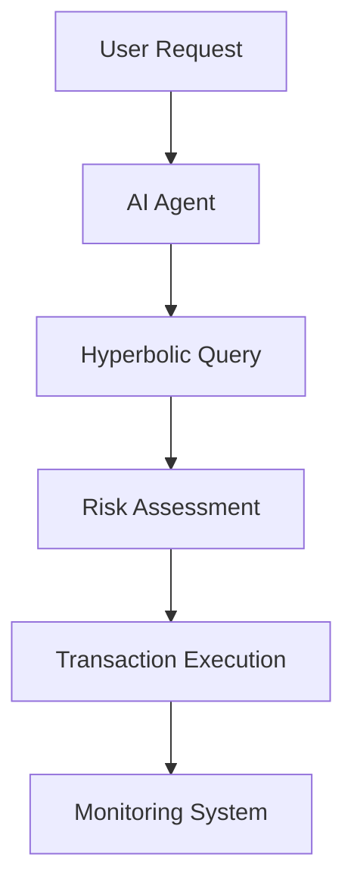

# Crypto Security Monitoring System

A comprehensive security system for monitoring crypto swaps and detecting suspicious transfer patterns using AI and real-time data analysis.

## 🚀 Features

### Smart Swap Monitoring
- Real-time price monitoring across multiple data sources
- Automated risk assessment before swap execution
- Integration with Hyperbolic for optimal pricing
- Continuous monitoring of token metrics
- Instant alert system for suspicious activities

### Transfer Pattern Detection
- Custom LLM for transaction pattern analysis
- Pre-flagged address database
- Real-time behavioral analysis
- Automated risk scoring system

## 📋 Prerequisites

```bash
# Required APIs and Services
- Alchemy WebSocket subscription
- Web3 Provider
- Hyperbolic API access
- Various DEX API keys
```

## 🛠️ Installation

```bash
# Clone the repository
git clone https://github.com/yourusername/crypto-security-monitoring

# Install dependencies
npm install

# Configure environment variables
cp .env.example .env
```

## 🌐 Project Branches

### Frontend
- Switch to `frontend` branch for UI components
- Contains all frontend code and assets

### AWS LLM Deployment
- Switch to `AWS` branch for cloud deployment
- Contains LLM configuration and cloud setup

## ⚙️ Configuration

Create a `.env` file with the following:
```env
ALCHEMY_API_KEY=your_key_here
HYPERBOLIC_API_KEY=your_key_here
WEB3_PROVIDER_URL=your_provider_url
```

## 🔧 Usage

### Starting the Monitoring System
```bash
# Compile TypeScript
npx tsc

# Run the transaction handler
node dist/handletxns.js
```

### Available Commands
Send prompts to interact with the system:
- "swap token A for token B"
- "check my eth balance"
- [Add other available commands here]

## 🔐 Security Features

1. **Risk Assessment**
   - Low/Medium/High risk classification
   - Automatic transaction blocking for high-risk scenarios
   - Real-time price manipulation detection

2. **Pattern Recognition**
   - Rug pull detection
   - Wash trading identification
   - Front-running prevention
   - Honeypot contract detection

## 📊 Architecture



## 📝 License

This project is licensed under the MIT License - see the [LICENSE.md](LICENSE.md) file for details.

## 🙏 Acknowledgments

- Hyperbolic team for API support
- Alchemy for WebSocket infrastructure
- Open-source AI/ML community

## ⚠️ Disclaimer

This software is for monitoring purposes only. Always conduct your own research before executing any cryptocurrency transactions.
